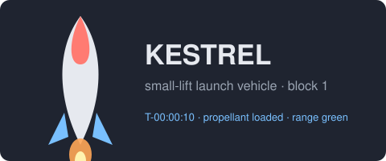
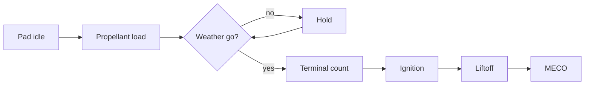

# Kestrel Launch Control

Mission control software for the **Kestrel** small-lift rocket: a launch
sequencer in Rust, a ground-control CLI in Go, trajectory tooling in Python,
and a live telemetry dashboard in TypeScript. Everything here is fictional and
exists so that editors have something pretty to render.



## Launch sequence



## Status

| Subsystem      | Owner     | State        | Notes                              |
| -------------- | --------- | ------------ | ---------------------------------- |
| Sequencer      | flight    | ✅ ready      | abort ladder under review          |
| Telemetry      | ground    | ✅ ready      | 50 Hz downlink, 12 channels        |
| Trajectory     | guidance  | ⚠️ in review  | Hohmann estimates need validation  |
| Dashboard      | ground    | 🚧 building   | live panel, no replay yet          |
| Range safety   | range     | ⛔ blocked    | waiting on FTS certification       |

## Quick start

```sh
cargo run --bin sequencer -- --mission mission.toml --dry-run
go run ./cmd/ground-control status
python3 tools/trajectory.py --apogee 210 --perigee 190
```

## Reading

- [[Telemetry]] describes the downlink frame and channel map.
- [[Abort Modes]] lists every hold and abort ladder rung.
- [Architecture](docs/ARCHITECTURE.md) is the systems view.
- [Runbook](docs/RUNBOOK.md) is what the console operator follows on launch day.

> [!tip] First time here?
> Start with the [Runbook](docs/RUNBOOK.md); it links to everything else in
> the order you will need it.

The sequencer's hold logic is the most delicate part[^1], so read
[Abort Modes](docs/notes/Abort%20Modes.md) before touching it.

[^1]: A hold that releases half a second late is a scrub; half a second early
    is a headline.
