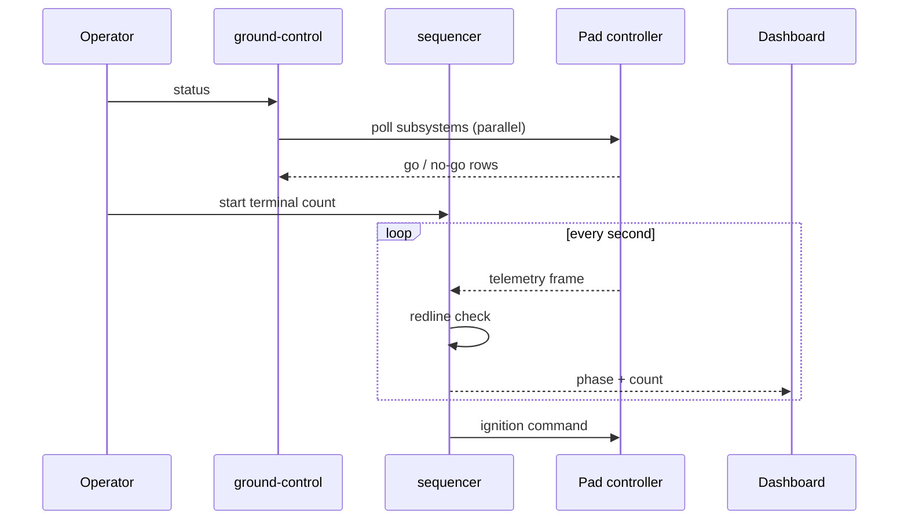

# Architecture

Four programs, one manifest. Everything reads `mission.toml`; nothing writes
it during a count.



## The sequencer

The count is a small state machine. Holds are automatic on a redline and
released by the operator; aborts only happen inside T-10 when a hold would
be worse than a scrub.

```rust file=src/sequencer.rs lines=10-18
#[derive(Clone, Debug, PartialEq)]
pub enum Phase {
    PadIdle,
    PropellantLoad,
    TerminalCount,
    Hold { at: i64, reason: String },
    Ignition,
    Liftoff,
}
```

The redlines live next to the state machine so that a reviewer sees both at
once:

```rust file=src/sequencer.rs lines=77-80
```

## Telemetry

Frames are 12 channels at 50 Hz; the channel order is fixed in
[[Telemetry]] and mirrored in `src/telemetry.rs` and `dashboard/src/app.ts`.
Changing the order is a three-file change and a checklist item in
[PLAN](PLAN.md).

## Ground control

`ground-control status` polls every subsystem in parallel with a per-call
timeout, then prints a go/no-go table and exits non-zero if anything is
no-go. It is deliberately boring; the interesting failure modes are in the
[Runbook](RUNBOOK.md).
