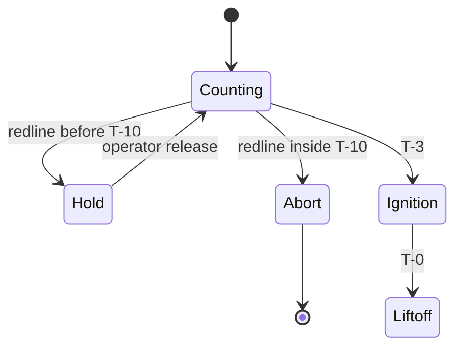

# Abort Modes

Holds are recoverable. Aborts are not. The sequencer decides between them
using the time in the count. #safety

## Ladder

1. **Chamber pressure** over 92 bar after ignition: abort, no exceptions.
2. **LOX ullage** under 3.2 bar inside T-2:00: hold, recheck every 10 s.
3. **Bus voltage** under 27.5 V: hold, swap to ground power.

> [!question] Why does a low bus hold rather than abort?
> Ground power is available until the umbilicals retract at T-2. Before
> that a low bus is a nuisance, not a danger.

Related: [[Telemetry]] for the channels these read from, and the
[Runbook](../RUNBOOK.md) for what the operator says on the loop.
