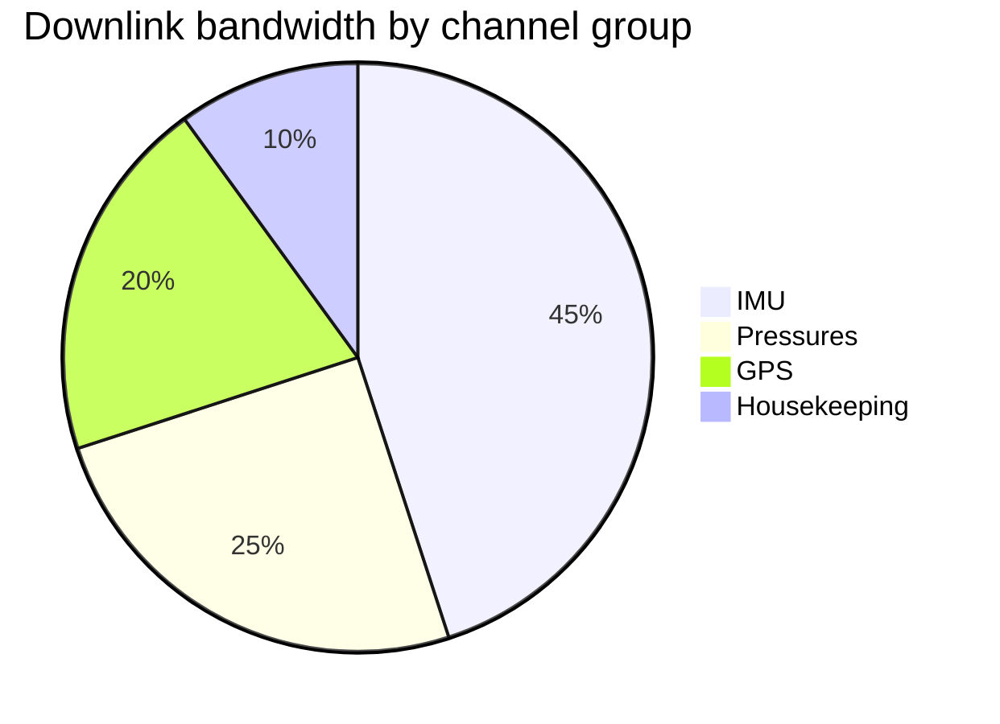

# Telemetry

The downlink is a fixed 12-channel frame at 50 Hz. Channel order matters:
the dashboard indexes by position, not by name. #telemetry #downlink

| # | Channel       | Unit | Range        |
| - | ------------- | ---- | ------------ |
| 0 | `pc`          | bar  | 0 – 100      |
| 1 | `lox_p`       | bar  | 0 – 6        |
| 2 | `rp1_p`       | bar  | 0 – 6        |
| 3 | `imu_ax`      | m/s² | ±50          |
| 4 | `imu_ay`      | m/s² | ±50          |
| 5 | `imu_az`      | m/s² | ±50          |
| 6 | `gps_alt`     | m    | 0 – 400 000  |
| 7 | `gps_vel`     | m/s  | 0 – 8 000    |
| 8 | `bat_v`       | V    | 24 – 30      |
| 9 | `fts_arm`     | bool |              |
| 10 | `valve_state` | mask |              |
| 11 | `temp_eng`    | °C   | -50 – 900    |

> [!note] Why 50 Hz
> The IMU is the only channel that needs it. Everything else would be fine at
> 5 Hz, but one rate keeps the frame ==dead simple==.

## Redlines

The sequencer watches three of these during the count; see [[Abort Modes]]
for what happens when one trips.

